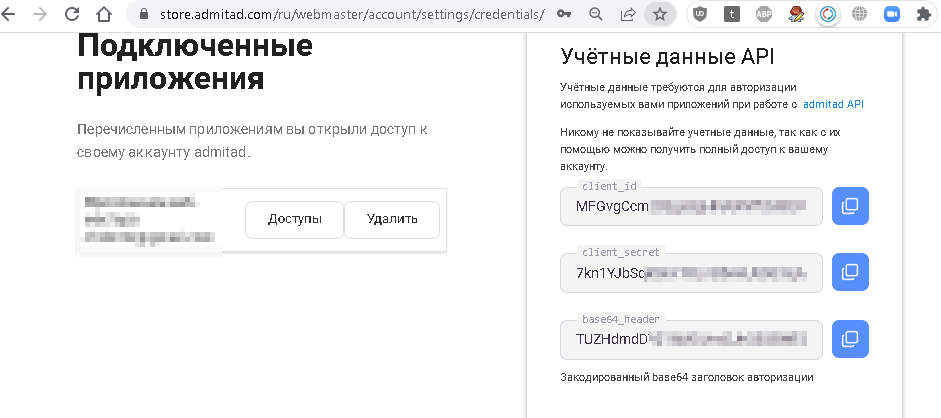
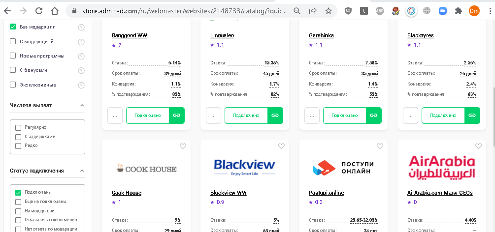

Задача — сделать приложение на Spring Boot Framework. Для работы с БД использовать MyBatis + MySql.

Исходные данные.

Есть внешний HTTP сервис (далее **Admitad**), который поддерживает Basic авторизацию.

Подробнее о сервисе - https://developers.admitad.com/ru/doc/webmaster-api/

Реквизиты доступа передаются посредством передачи в header basicAuthKey и client_secret (строки в Base64) - используется один раз при
получении первой пары токенов.

После авторизации на **Admitad** получаем два токена - auth и refresh. Для токена получаем время его жизни в секундах.

Auth-токен обновляем при помощи refresh-token, до истечения срока действия.

Admitad отдает некий json, содержащий нужные данные. Необходимо из полученного json выделить полезные данные (ограниченный набор полей),

и сохранить их в БД (MySQL) как можно ближе к 3-ей нормальной форме.

Получение json из сервиса и обновление БД необходимо сделать по расписанию.

Реквизиты доступа к Admitad необходимо разместить в файле account.properties (в папке resources рядом с
application.properties). Эти реквизиты доступны в личном кабинете сервиса **Admitad** (ниже образец заполнения):

```
basicAuthKey=2wew44sdsASCFR

clientId=wew44sdsASCFR

clientSecret=7kn
```

В сервисе в личном кабинете это выглядит так


В application.properties есть параметр 

admitadDataUrl=https://api.admitad.com/advcampaigns/website/2148733/?limit=50

где 2148733 - это id сайта (площадки, в более широком смысле) для рекламных программ. 

Площадку необходимо создать в личном кабинете. 

Для тестовых целей, чтобы api admitad мог отдавать данные, к созданной

площадке (задайте произвольный сайт) надо привязать программы, не требующие модерации:





